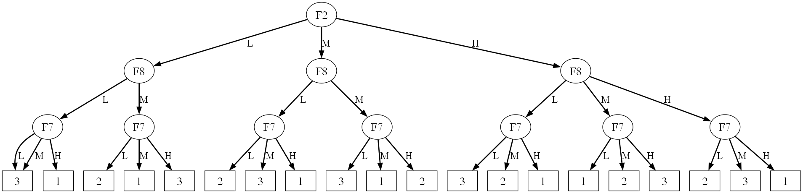

# Fuzzy Tree Plotter

[](LICENSE)


Fuzzy Tree Plotter is a small Python library for turning fuzzy rules into a visual decision tree generated with Graphviz. The project reads text-based rules, organizes them into a tree structure, and produces an image that is ready to inspect or share.

## Example Output

This is an example of the tree generated by the project:



## Overview

The main class, `FuzzyTreePlotter`, accepts two kinds of input:

1. an in-memory list of rules;
2. the path to a `.txt`, `.csv`, or `.json` file containing rules.

Each rule is parsed, inserted into the internal tree structure, and then exported as a Graphviz file. The final result can be displayed automatically or saved in a format of your choice.

## Requirements

- Python 3.11 or later.
- The Python package `graphviz`.
- A system-wide Graphviz installation with the `dot` command available on the `PATH`.

### Install Python dependencies

```bash
pip install graphviz
```

### Install Graphviz

Graphviz must be installed separately because the Python package provides integration, but not the rendering engine itself. On Windows, make sure the Graphviz `bin` folder has been added to the system `PATH`.

Official download:

https://graphviz.org/download/

## Rule format

Rules must follow this syntax, case-insensitive:

```text
if <attribute> is <value> [and <attribute> is <value> ...] then <outcome>
```

### Valid examples

```text
if F2 is L and F8 is L and F7 is L then 3
if F2 is H and F8 is M and F7 is H then 1
```

### Format notes

- Every condition must use the form `<attribute> is <value>`.
- Multiple conditions must be joined with `and`.
- The part after `then` is the outcome associated with the rule.
- Rules can be written in uppercase, lowercase, or mixed case.

## Usage

### Use with a Python list

```python
from fuzzy_tree_plotter import FuzzyTreePlotter

rules = [
    "if F2 is L and F8 is L and F7 is L then 3",
    "if F2 is L and F8 is L and F7 is M then 3",
    "if F2 is L and F8 is L and F7 is H then 1",
]

plotter = FuzzyTreePlotter(
    rules,
    aggregate=True,
    text_size=20,
    line_width=2,
    edge_text_size=18,
)

plotter.render("fuzzy_tree", format="png", view=True)
```

### Use with a text file

The file must contain one rule per line, with no quotes and no extra text.

```python
from fuzzy_tree_plotter import FuzzyTreePlotter

plotter = FuzzyTreePlotter("rules.txt", aggregate=True)
plotter.render("fuzzy_tree", format="png", view=True)
```

### Included example files

The repository includes:

- `examples/demo_fuzzy_tree_plotter.py`, which shows two complete usage patterns;
- `examples/rules.txt`, which contains a ready-to-use set of rules for testing;
- `assets/fuzzy_tree_example.png`, which shows an example of the final result.

The demo writes its generated artifacts to `examples/demo_outputs/` and leaves them on disk for inspection. These files stay local and are not meant to be pushed to the remote repository.

## New Features

- The class now accepts any string iterable, not just a list or a file path.
- Rules loaded from `.txt` files ignore blank lines and comments that start with `#`.
- `.csv` files are read from the first column, one rule per row, and a simple `rule`/`rules` header row is ignored.
- `.json` files can contain either a list of rules or an object with a `rules` key.
- The `summary()` method returns a compact overview of the tree structure, which is useful for quick inspection.
- The `validate_rules()` method reports syntax errors, duplicates, and conflicts before rendering.
- The `detect_conflicts()` method returns only the conflicting rules.
- The `render()` method can keep or remove the Graphviz source file through the `cleanup_source` parameter.
- The `theme` parameter controls the overall graph style.
- Leaf colors can be customized with the `outcome_colors` mapping.
- The demo keeps generated files in `examples/demo_outputs/` instead of deleting them.
- The main demo now lives under `examples/` and uses robust `Path`-based file handling.

## API

### `FuzzyTreePlotter(rules, aggregate=False, text_size=12, line_width=1, edge_text_size=12, theme="balanced", outcome_colors=None)`

| Parameter | Type | Default | Description |
|---|---|---|---|
| `rules` | `list[str]` or `str` | required | A list of rules or the path to a `.txt`, `.csv`, or `.json` file |
| `aggregate` | `bool` | `False` | Merge leaf nodes that share the same outcome |
| `text_size` | `int` | `12` | Font size for tree nodes |
| `line_width` | `int` or `float` | `1` | Edge stroke width |
| `edge_text_size` | `int` | `12` | Font size for edge labels |
| `theme` | `str` | `"balanced"` | Graph styling profile: `balanced`, `compact`, or `presentation` |
| `outcome_colors` | `dict[str, str]` | `None` | Optional mapping of outcomes to custom leaf colors |

### `render(filename="fuzzy_tree", format="png", view=True)`

Generates the tree graph and saves it to disk.

| Parameter | Type | Default | Description |
|---|---|---|---|
| `filename` | `str` | `"fuzzy_tree"` | Output file name without extension |
| `format` | `str` | `"png"` | Output format, for example `png`, `pdf`, or `svg` |
| `view` | `bool` | `True` | Open the generated file automatically |
| `cleanup_source` | `bool` | `True` | Remove the Graphviz source file after rendering |

### `summary()`

Returns a dictionary with useful information about the generated tree, including the number of rules, internal nodes, leaf nodes, maximum depth, discovered attributes, and observed outcomes.

### `validate_rules()`

Validates all rules and returns a report with syntax errors, duplicate rules, and conflicts where the same conditions lead to different outcomes.

### `detect_conflicts()`

Returns only the conflicting rules discovered during validation.

## Aggregation Behavior

When `aggregate=True`, leaf nodes with the same final outcome are grouped together to reduce visual repetition. This is useful when many rules lead to the same result and you want a more compact tree.

## License

This project is distributed under the MIT License. See the [LICENSE](LICENSE) file for the full text.

## Author

Giustino C. Miglionico
